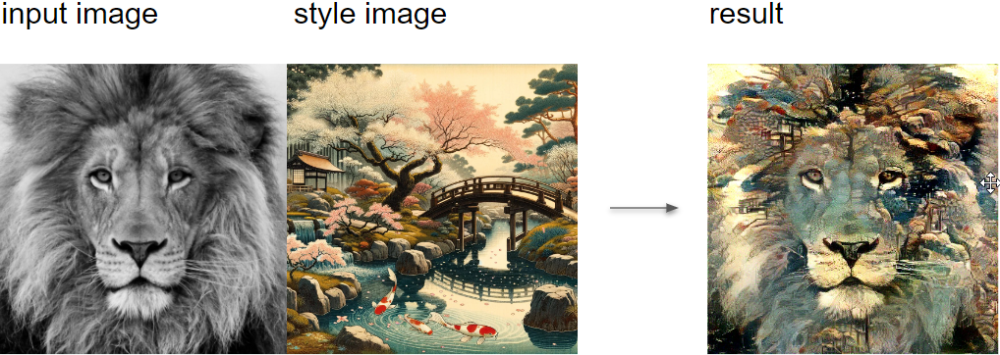
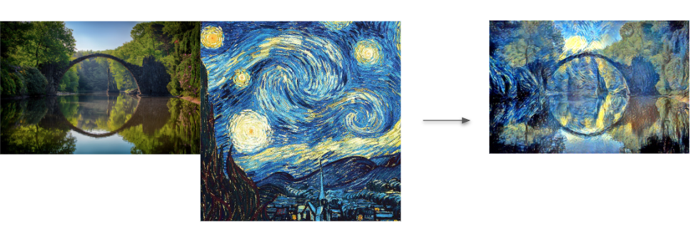

## Telegram bot with Neural Style Transfer (optimization method) 
This repo contains a code of a simple Telegram chatbot based on aiogram library with PyTorch implementation of the original NST (Neural Style Transfer ) paper (:link: [Gatys et al.](https://www.cv-foundation.org/openaccess/content_cvpr_2016/papers/Gatys_Image_Style_Transfer_CVPR_2016_paper.pdf)). 
based on Vgg19 CNN network as a final work fpr "Deep Learning (семестр 1, осень 2023)" course. 

### What is Neural Style Transfer  algorithm?
The algorithm transfers style from one input image (the style image) onto another input image (the content image) using CNN nets (usually VGG-19) and gives a composite, stylized image out which keeps the content from the content image but takes the style from the style image.
## Examples 

Vgg19 CNN model principal sheme: 

Transfering style gives beautiful artistic results:

### Optimization initialization

Starting with different initialization images: noise (white or gaussian), content and style leads to different results.  
Empirically content image gives the best results as explored in [this research paper](https://arxiv.org/pdf/1602.07188.pdf) also.  
Here you can see results for content, random and style initialization in that order (left to right):
You can also see that with style initialization we had some content from the artwork leaking directly into our output.

## Setup

1. Install python 3.10 
2. use requirements.txt to install all requirement libs
3. set BOT_TOKEN as envirement variable 

For GPU acceleration install 

## How to run 
1. create a telegram chatbot using @botfather, generate bot token key
2. set BOT_TOKEN as envirerment variable 
3. run app.py 
users input and results images will be stored in the /data/ folder 

## Acknowledgements

{Gordić2020nst,
  author = {Gordić, Aleksa},
  title = {pytorch-neural-style-transfer},
  year = {2020},
  publisher = {GitHub},
  journal = {GitHub repository},
  howpublished = {\url{https://github.com/gordicaleksa/pytorch-neural-style-transfer}},
}

## Licence

